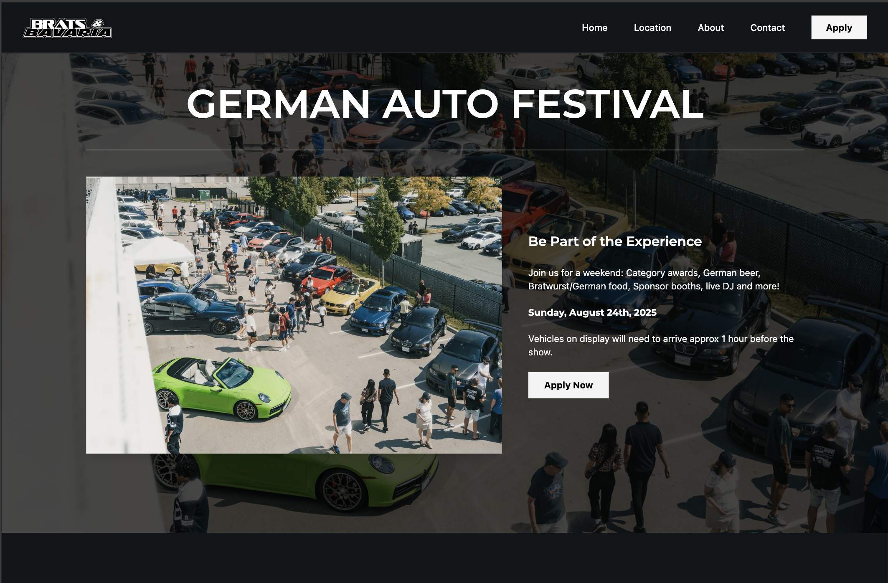
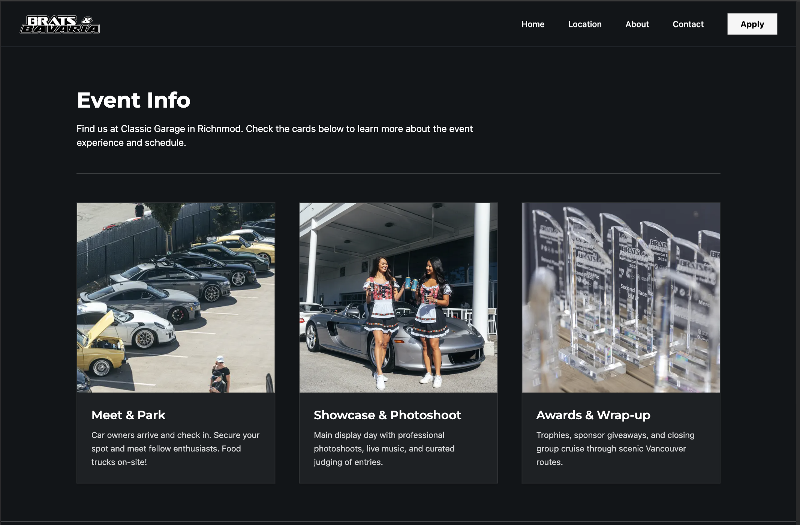
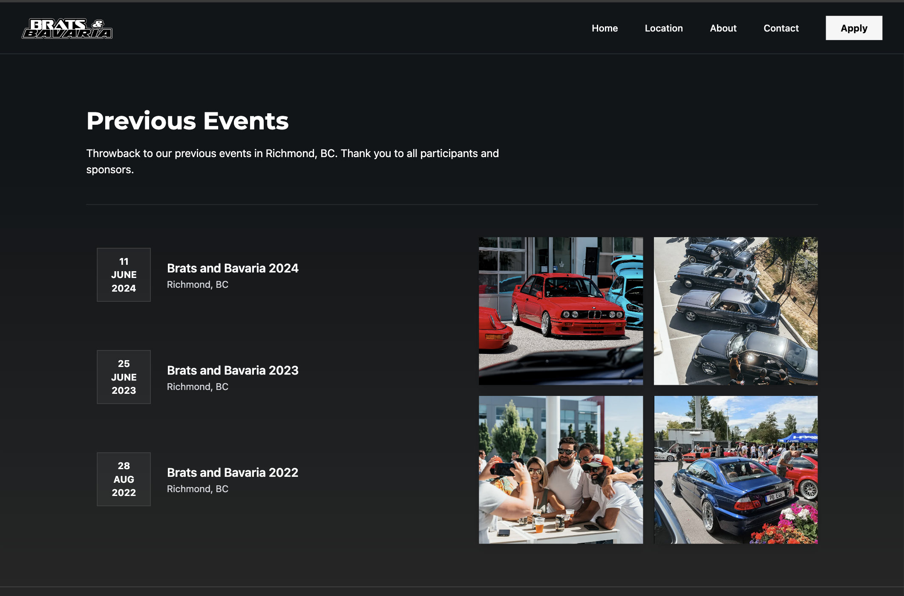
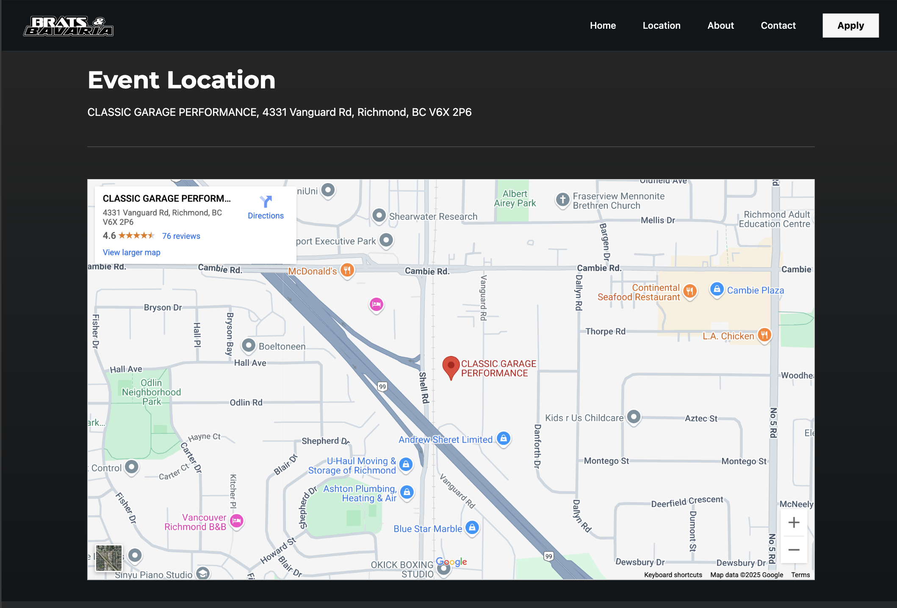
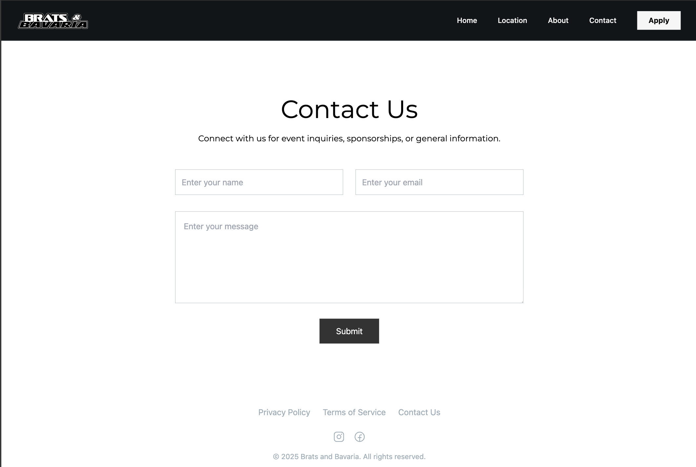
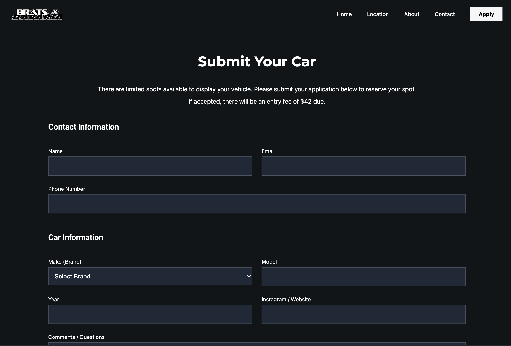
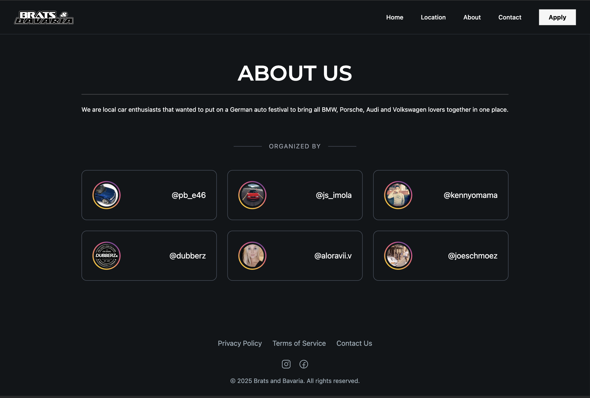

<p align="center">
  
</p>


A modern web platform for German car event submissions.  
       
     
Built to simplify the car selection and event registration process with a clean submission form, image handling, admin dashboard, email flow, and Stripe payment integration.

---

## 🔗 Live Demo  
**🌐 Website:** [https://bratsandbavaria.com](https://bratsandbavaria.com)

---

## 🛠️ Tech Stack  
- **Frontend:** Next.js 15 (App Router), Tailwind CSS  
- **Backend:** Supabase (PostgreSQL, Auth)  
- **Image Hosting:** Cloudinary  
- **Payments:** Stripe
- **Email:** Resend  
- **Deployment:** Vercel  

---

## ✨ Features  
- 📝 Submission form with car details, contact info, and custom questions  
- 📷 Upload 3–5 photos (auto-compressed + stored in Cloudinary)  
- 👀 Admin dashboard to manage and track submissions  
- 📧 Auto email with Stripe link sent to approved users (via Resend)  
- 💳 Stripe payments collected after approval  
- 🗺️ Google Maps to show event location  
- 🔒 Admin-only access via Supabase Auth  
- 📬 Contact form for user-to-organizer messaging  
  
---

## 📸 Screenshots

Here are some previews of the main pages:

| Page         | Screenshot |
|--------------|------------|
| Header       |  |
| Info         |  |
| Previous     |  |
| Location     |  |
| Contact Us   |  |
| Submit       |  |
| About Us     |  |

---

## 💡 Motivation

This project was built to support a real-world car show.     

         
Previously, organizers used a mix of Google Forms, manual email approvals, and e-transfer payments — a slow, error-prone workflow. This app replaces that entire process with a single streamlined platform that handles photo submissions, admin review, payment tracking, and communication — all in one place.


---

## 📁 Project Structure

```txt
src/
  ├── app/           # App routes (submit form, admin dashboard, static pages, API routes)
  ├── components/    # Reusable UI components
  ├── lib/           # Supabase client, admin, and DB logic
  ├── types/         # Database and API response types
  └── utils/         # External service handlers (Resend, Stripe)

public/              # Static assets (images, screenshots, etc.)

next.config.ts       # Next.js configuration  
tailwind.config.js   # Tailwind CSS setup  
package.json         # Project metadata and scripts


