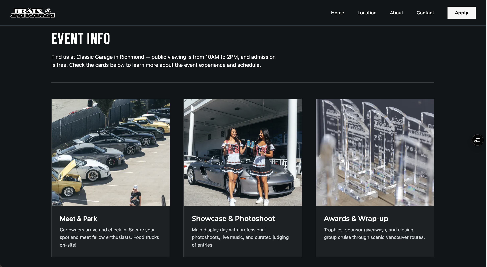
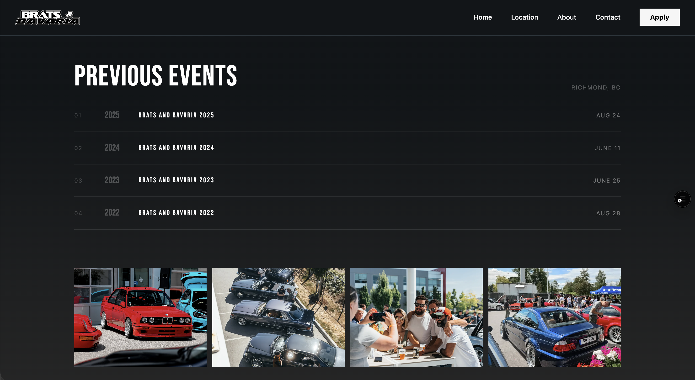
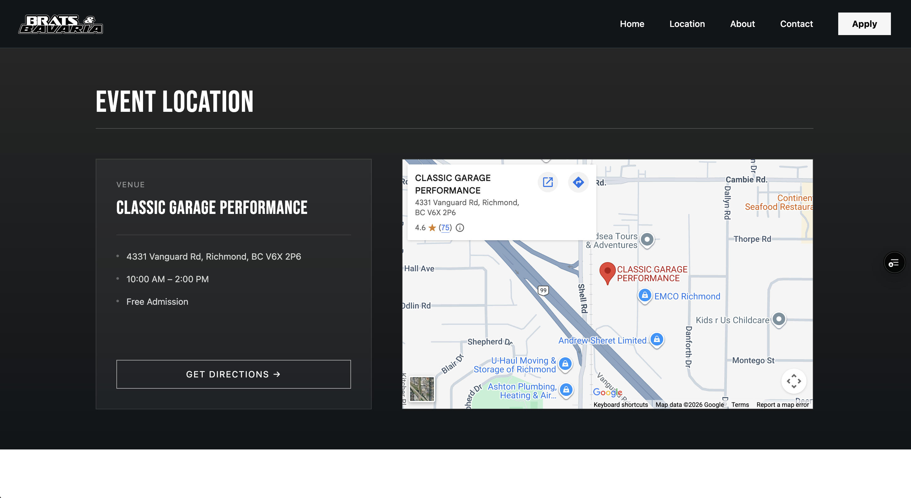
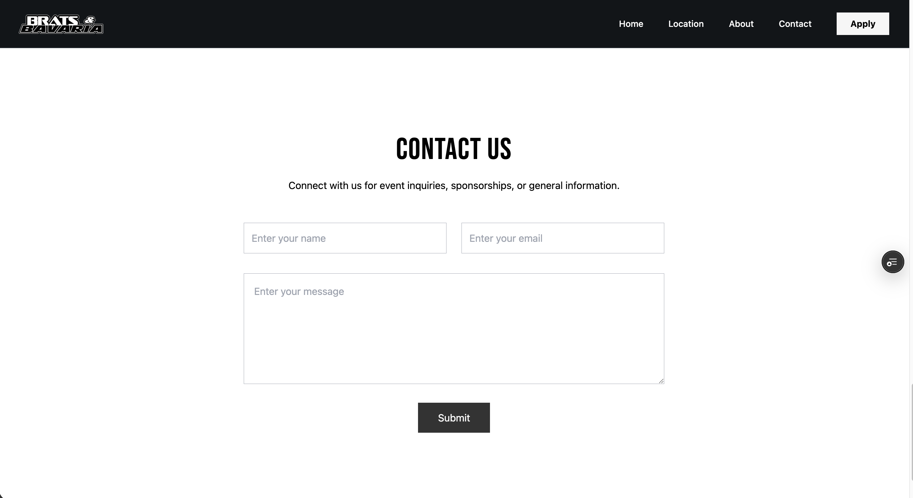
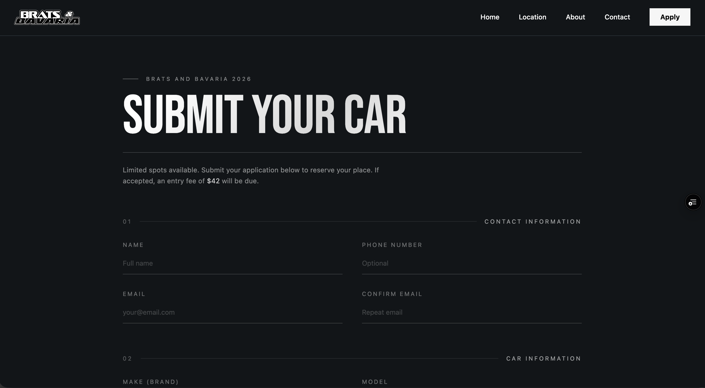
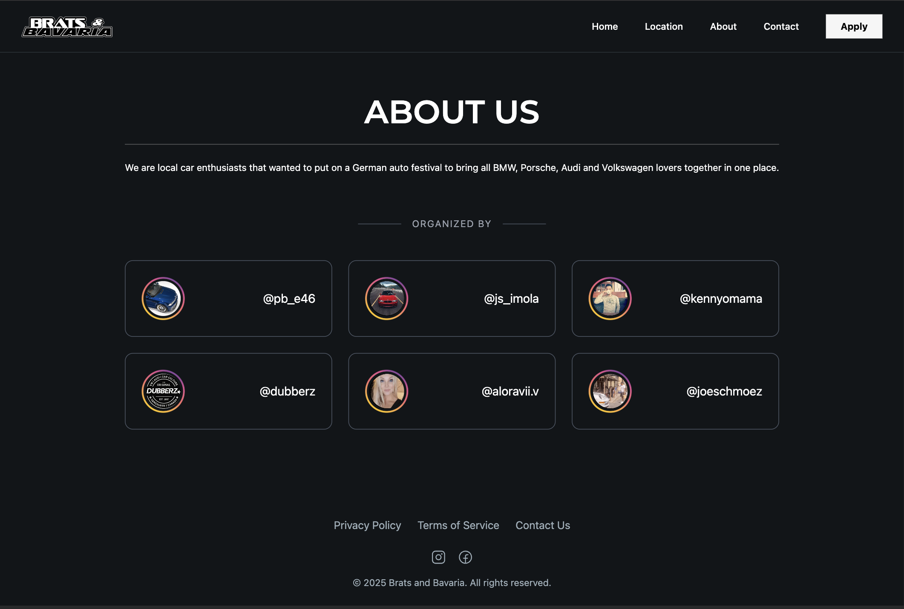
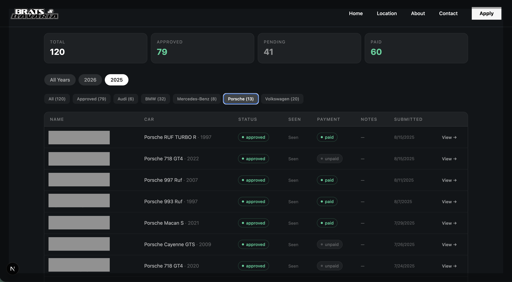

<p align="center">
  
</p>

A modern web platform for German car event submissions.

Built to simplify the car selection and event registration process with a clean submission form, image handling, admin dashboard, email flow, and Stripe payment integration.

---

## 🔗 Live Demo

**🌐 Website:** [https://bratsandbavaria.com](https://bratsandbavaria.com)

---

## 🛠️ Tech Stack

- **Frontend:** Next.js 16 (App Router), Tailwind CSS
- **Backend:** Supabase (PostgreSQL, Auth)
- **Image Hosting:** Cloudinary
- **Payments:** Stripe
- **Email:** Resend
- **Deployment:** Vercel

---

## 🧪 Testing

- **Framework:** Jest + React Testing Library
- **Test Suites:** 8 suites · 40 tests
- **Coverage:** API route handlers, UI components, form validation, payment webhook

<p align="center">
  
  
</p>

**✅ Key Features Tested**

| Area               | What's Tested                                                          |
| ------------------ | ---------------------------------------------------------------------- |
| **Submit API**     | Applicant upsert, submission insert, photo insert, error handling      |
| **Admin API**      | Submission listing, year filter, descending sort order                 |
| **Stripe Webhook** | Signature verification, payment status update, unhandled event types   |
| **Contact API**    | Email sending via Resend, failure and exception handling               |
| **Submit Form**    | Email match validation, photo count limits (3–5), form field rendering |
| **Contact Form**   | Sending state, success/error messages, correct fetch payload           |
| **Nav Component**  | Link rendering, Apply button routing, mobile menu open/close           |

---

## ✨ Features

- 📝 Submission form with car details, contact info, and custom questions
- 📷 Upload 3–5 photos (auto-compressed + stored in Cloudinary)
- 👀 Admin dashboard to manage and track submissions
- 📧 Auto email with Stripe link sent to approved users (via Resend)
- 💳 Stripe payments collected after approval
- 🗺️ Google Maps to show event location
- 🔒 Admin-only access via Supabase Auth
- 📬 Contact form for user-to-organizer messaging

---

## 📸 Screenshots

Here are some previews of the main pages:

| Page       | Screenshot                                           |
| ---------- | ---------------------------------------------------- |
| Header     |     |
| Info       |       |
| Previous   |   |
| Location   |   |
| Contact Us |  |
| Submit     |     |
| About Us   |    |
| Admin Page |      |

---

## 💡 Motivation

This project was built to support a real-world car show.

Previously, organizers used a mix of Google Forms, manual email approvals, and e-transfer payments — a slow, error-prone workflow. This app replaces that entire process with a single streamlined platform that handles photo submissions, admin review, payment tracking, and communication — all in one place.

---

## 📁 Project Structure

```txt
src/
  ├── app/           # App routes (submit form, admin dashboard, static pages, API routes) with tests
  ├── components/    # Reusable UI components
  ├── lib/           # Supabase client, admin, and DB logic
  ├── types/         # Database and API response types
  └── utils/         # External service handlers (Resend, Stripe)

public/              # Static assets (images, screenshots, etc.)
jest.config.js       # Jest testing configuration
jest.setup.js        # Test environment setup
next.config.ts       # Next.js configuration
tailwind.config.js   # Tailwind CSS setup
package.json         # Project metadata and scripts


```
